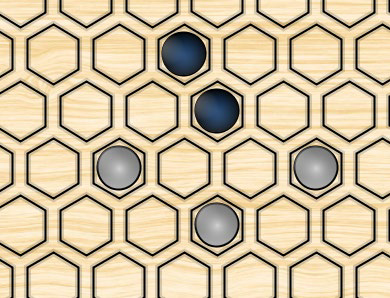
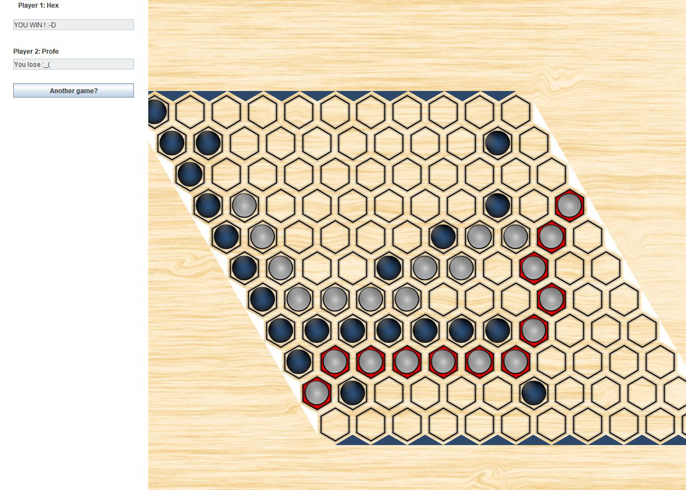
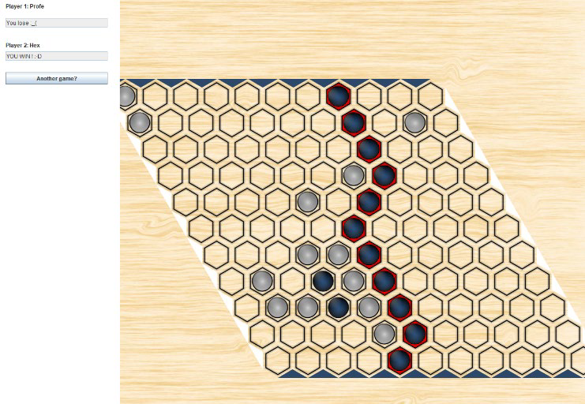
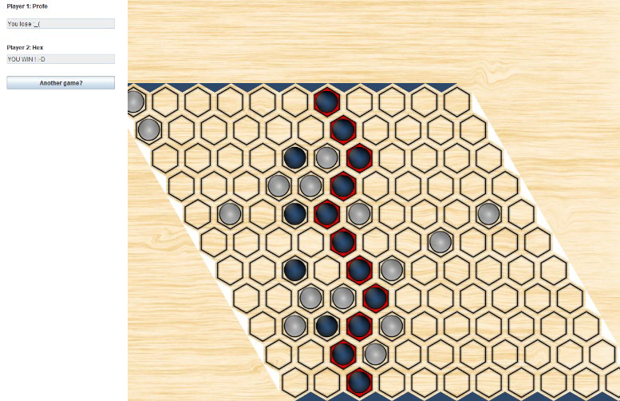
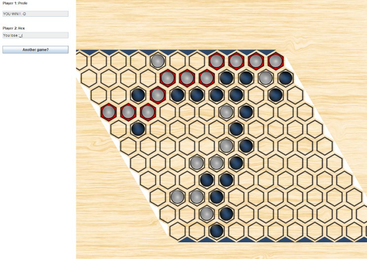
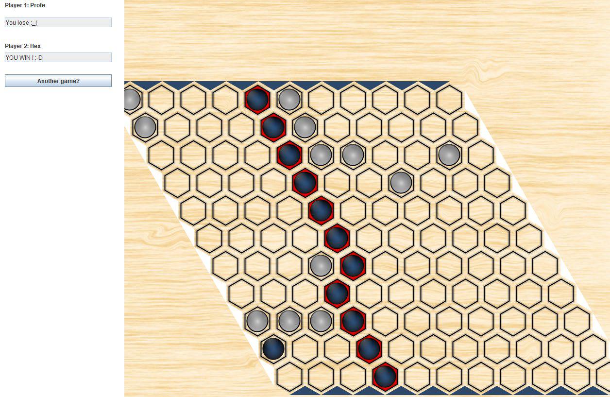

# HexGame
========================
HexGame Usign Min-Max with dijkstra

# ParallelPlayer

Esta clase es la principal de nuestro proyecto, es donde se a programado el algoritmo MinMax con poda α-β (las funciones max\_value y min\_value que explicaremos en profundidad más adelante), también realizara el calculo de donde va a realizar el movimiento dado el tablero actual con la ayuda de una clase externa llamada Commons. Por ultimo tambin se h an programado las funciones de inicialización y de petición del nombre de nuestro jugador (necesarias para la implementación con la clase Hex). 

Dado que utilizaremos paralelismo en nuestros cálculos, hemos tenido que importar la librería ato- mic(en este caso AtomicReference) para poder pasar y modificar datos a las funciones paralelas. 

## Move 

Como hemos comentado anteriormente, esta función evaluara el tablero con ayuda de la clase Com- mons y de MinMax, asimismo también hemos utilizado paralelismo para agilizar los cálculos (la mejoría de estos dependerá de la cantidad de núcleos que tenga la máquina). Ahora vayamos a analizar la función: 

Primeramente declaramos dos conjuntos de puntos (moves y allStones) que guardaran las posiciones ocupadas por las fichas (de color 1 o -1) y las posiciones vacías (o de color 0). En el caso de que el tablero se en- cuentre vacío reconvertimos moves a una tabla hash (para optimizar las consultas, dado que para el caso medio y el caso máximo es de coste constante o 1), sino colocamos la primera ficha en el medio del tablero (posición 5,5) porque es la posición óptima. 

Después vamos a ejecutar el algoritmo MinMax con paralelismo, dando el valor a alfa menos infinito y declaramos el mejor punto donde colocar la ficha como -1,-1. Para la ejecución en paralelo declararemos una función alfa donde, para todos los movimientos posibles de ese tablero, realizaremos la llamada Min, ademas de mirar para la poda  α-β. 

En el caso de que el punto seleccionado fuese -1,-1 devolvemos el primer movimiento de moves sino, el mejor movimiento calculado. 

## max\_value y min\_value 

Este para de funciones son las que nos permitirán calcular el algoritmo MinMax. En primer lugar evalua- remos si no quedan más turnos que calcular, para así retornar el valor heurístico del tablero. En el caso contra- rio, generaremos un nuevo tablero, colocaremos una nueva ficha del color correspondiente (en el caso max del nuestro color y en el min del color de nuestro oponente), en el caso de que fuese game over el movimiento de- volveríamos infinito, sino llamaríamos a la función contraria para todos los posibles movimientos del tablero ge- nerado 

# Explicación de la heurística:

La heurística del juago esta basada exclusivamente el los grafos de Dijkstra, de tal forma que la parta mas impor- tante de nuestra heurística reside en la implementación y generación de los valores de nuestro grafo, esto im- plica un gran coste de análisis del tablero para valorar el coste de cada uno de los enlaces entre nodos. 

Nuestra implementación está basada en dos estrategias típicas del juego, el corte de caminos y avanzar en dia- gonales para favorecer a defensa del camino, las cuales se complementan una con la otra. 

## Ejemplos de puntuación: 

Por ejemplo, en esta imagen, el jugador blanco tiene una gran ven- taja, aplicando la estrategia, el coste el jugador blando para avan- zar recto, tendría un coste de 30, debido a que si avanza, el juga- dor blanco le tapara el camino, y por otro lado, el jugador blanco, el coste de unir una de las piezas es 4 veces mejor que poner una pieza en cualquier otro sitio, de tal forma que premiamos el ca- mino en diagonal, además de perjudicar a nuestro enemigo, de esta forma se consigue una muy buena estrategia. 

## Problemas de la heurística: 

El problema es que muchos movimientos nos generan la misma puntuación, y al usar threads en el min max, nos generan resultados distintos al ejecutarlo varias veces. Por ejemplo, si jugamos contra el jugador proporcionado por el profesor, ganamos siempre si empezamos, pero no si empieza el profesor, algunas veces perdemos, aparte, si se ejecuta con otro ordenador con mas threads el resultado podría variar aún más. 

Como podemos observar en las capturas de pantalla, mismos jugadores, distintos resultados. 

## Ejemplos empezando nuestro jugador: 

## Ejemplos empezando el jugador profe: 

